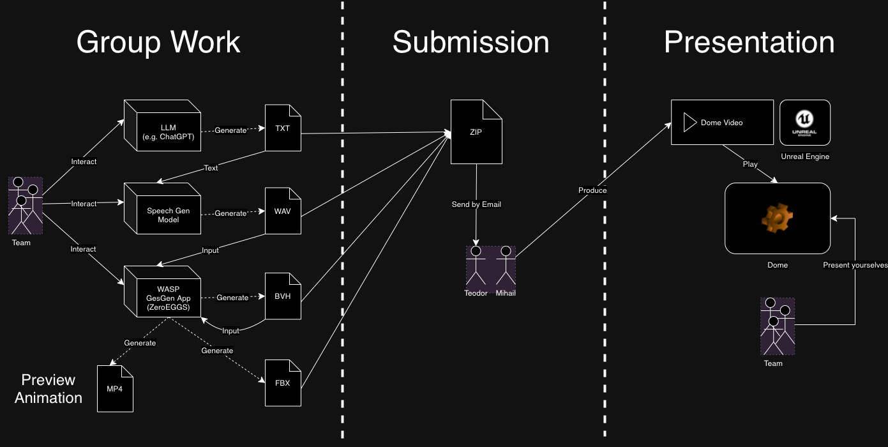

# Assignment
## Goal

This assignment lets you explore how AI can be used to create a complete storytelling experience. You'll use AI to script a story, turn it into speech, and animate it with gesturing avatars. The focus is on understanding how these tools work together, using the files you generate and the parameters you control. This is your opportunity to experiment, learn, and have fun with the technology.

## Theme Description

This year's theme, **"Cringy Sitcom"**, invites you to create awkward and exaggerated scenes reminiscent of classic TV sitcoms. Think of cheesy one-liners, over-the-top reactions, and characters who find themselves in hilariously uncomfortable situations. While the theme serves as a fun, unifying idea for all submissions, it's just a suggestion - you're free to get creative and go in any direction you like. The theme will also guide the hosts who present the final videos, adding some light-hearted humor to the showcase.

## Process

The assignment is split in three stages:

**Stage 1. Group Work**

You work with your team to create text, audio, and animation files for your story.

- Text (`.txt`): You use LLMs (like ChatGPT) to create a script for your story.
- Audio (`.wav`): You use a text-to-audio model to generate speech audio. This year, you will most likely use the model you trained for the pre-summer school assignment (on Canvas). You can use different voices for this, not just your own. You can also stitch the audio and add silence to control the pacing.
- Animation (`.bvh`, `.fbx`): You use the WASP gesgen app to generate gesture animations from speech audio.

**Stage 2. Submission**

You package all created files to a `.zip` archive which you submit to us. [(more info)](./submission.md)

**Stage 3. Presentation**

We take your files and use them to produce movie sequences in Unreal Engine. We will put a brief intro and outro at the beginning and end of your story to glue your submission with the overarching *Cringy Sitcom* theme.

We then play these sequences in the Norrkoping Visualization Center Dome. You will be invited to briefly present your team before we play your submision.

**2023 Submissions**

- [Talent Show Introduction](https://youtube.com/watch?v=GivcAqaoIQ4)
- [Team: Algorithmic Amigos](https://youtube.com/watch?v=RyWqAy3Yidk)
- [Team: VR WASP Wizards](https://youtube.com/watch?v=CeGuwhIivNY&t=16s)
- [Team: Artificial Four](https://youtube.com/watch?v=Obdmat3U7s0)
- [Team: Quebec](https://youtube.com/watch?v=dor8EfV6TeI&t=111s)
- [Team: Lucasfilm Ltd TM](https://youtube.com/watch?v=TppQ7tklMCQ)

**2022 Submissions**

- [Team 1](https://www.youtube.com/watch?v=IyaEcUJp6G8)
- [Team 2](https://www.youtube.com/watch?v=OJMNvtoPsfk)
- [Team 3](https://www.youtube.com/watch?v=3mwK3OCXH9k)
- [Team 4](https://www.youtube.com/watch?v=h8z85fxWz10)
