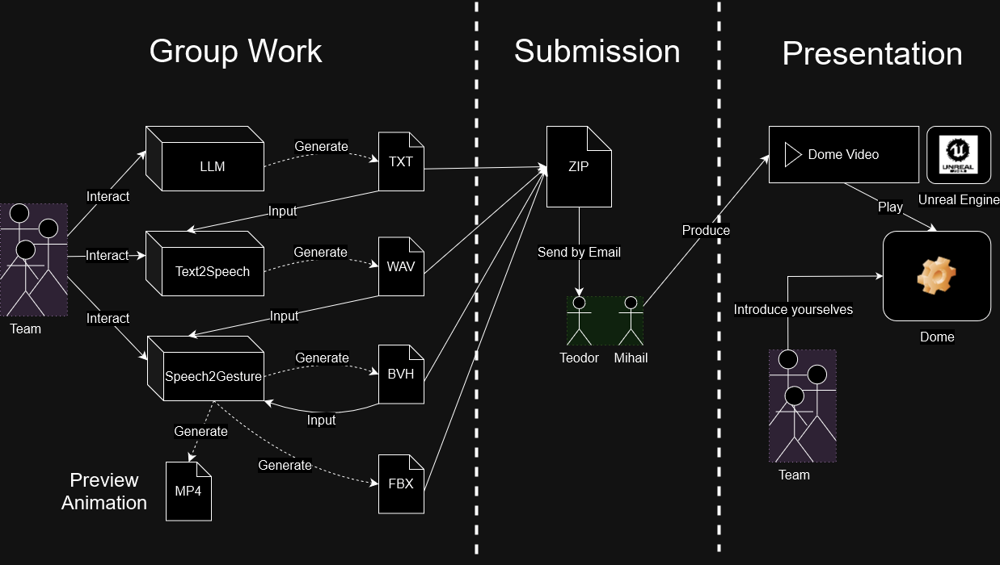

# Assignment

## Goal

This assignment lets you explore how deep generative models of human behaviour can be used to create a storytelling experience. You'll use machine-learning models (popularly called "generative AI") to script a story, turn it into spoken dialog audio, and animate it with gesturing avatars in a 3D environment. The focus is on getting a feel for these tools and how they can work together, using the files you generate and the parameters you control. Treat this as an opportunity to experiment, learn, and have fun with these technologies!

## Theme Description

This year's theme, **"Cringy Sitcom"**, invites you to create awkward and exaggerated scenes reminiscent of classic TV sitcoms. Think of cheesy one-liners, over-the-top reactions, and characters who find themselves in hilariously uncomfortable situations. While the theme serves as a fun, unifying idea for all submissions, it's just a suggestion - you're free to get creative and go in any direction you like. The theme will also guide the hosts who present the final videos, adding some light-hearted humor to the showcase.

## Process

The assignment is split in three stages:

### Stage 1. Group Work

You work with your team to create text, audio, and animation files for your story.

- Text (`.txt`): You create the script for your story with the help of LLMs like ChatGPT.
- Audio (`.wav`): You use a text-to-speech model to generate speech audio. For extra fun, you are encouraged to use your own voices that you fine-tuned during the pre-assignment for the characters.
- Animation (`.bvh`, `.fbx`): You use the WASP gesgen app to generate gesture animations from speech.

[Click here for a detailed tutorial for the group work](./tutorial.md)

### Stage 2. Submission

You package all created files to a `.zip` archive which you submit to us.

[Click here for the submission instructions](./submission.md)

### Stage 3. Presentation

We take your files and use them to produce movie sequences in Unreal Engine. We will put a brief intro and outro at the beginning and end of your story to glue your submission with the overarching *Cringy Sitcom* theme.

We then play these sequences in the Norrköping Visualization Center Dome. You will be invited to briefly present your team before we play your submision.

??? example "2023 Submissions (click to show)"
    
    - [Talent Show Introduction](https://youtube.com/watch?v=GivcAqaoIQ4)
    - [Team: Algorithmic Amigos](https://youtube.com/watch?v=RyWqAy3Yidk)
    - [Team: VR WASP Wizards](https://youtube.com/watch?v=CeGuwhIivNY&t=16s)
    - [Team: Artificial Four](https://youtube.com/watch?v=Obdmat3U7s0)
    - [Team: Quebec](https://youtube.com/watch?v=dor8EfV6TeI&t=111s)
    - [Team: Lucasfilm Ltd TM](https://youtube.com/watch?v=TppQ7tklMCQ)

??? example "2022 Submissions (click to show)"
    
    - [Team 1](https://www.youtube.com/watch?v=IyaEcUJp6G8)
    - [Team 2](https://www.youtube.com/watch?v=OJMNvtoPsfk)
    - [Team 3](https://www.youtube.com/watch?v=3mwK3OCXH9k)
    - [Team 4](https://www.youtube.com/watch?v=h8z85fxWz10)

## Special Thanks

The following great people helped us integrate the pre-assignment with the on-site assignment, including general support and coordination:

- Ossian Arn (MSc Student, KTH)
- [Shivam Mehta](https://www.kth.se/profile/smehta) (PhD Student, KTH)
- [Rahil Somaye](https://www.umu.se/en/staff/somayeh-jafari/) (Research Engineer, Umeå University)
- [Gustav Eje Henter](https://www.kth.se/profile/ghe) (Associate Professor, KTH)
