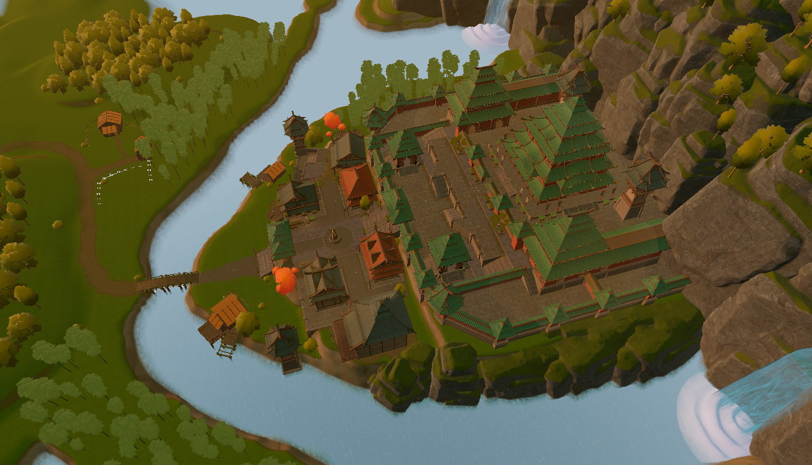

# Submission
To submit, send an email to `tnikolov@hotmail.com` OR `tsakovm@gmail.com`.

Your submission should be **2-5 minutes** long and be composed of the following files:

- a `.zip` of `.fbx` files
- a `.zip` of `.wav` files
- a `.txt` file

The `.fbx` and `.wav` files should be named in ascending order, starting from 0, in the order that they should be played back. Append `A`, `B`, `C`, `D` or `E` to each file to indicate which avatar you wish to use for the animation. The `.fbx` files are extracted using the gesture generation system.


*Example:*

```
- fbx.zip
    - 0A.fbx
    - 1C.fbx
    - 2C.fbx
    - 3B.fbx
    - 4C.fbx
    - 5D.fbx
- wav.zip
    - 0A.wav
    - 1C.wav
    - 2C.wav
    - 3B.wav
    - 4C.wav
    - 5D.wav
```

The `.txt` file should contain the following information:

- Team name or ID
- World

*Example:*

- Jackal.txt
    - Team "Jackal"
    - World "Tropical island"

We have the following teams this year:

1. *Algorithmic Amigos*
2. *VR WASP Wizards*
3. *Artificial Four*
4. *Quebec*
5. *Lucasfilm Ltd TM*

We offer 5 worlds to choose from:

**Egypt**


**Asian village**



**Tropical island**


**Venice**


**ForestLevel**


You can find more examples in the [images](https://github.com/Svito-zar/wasp-2023-summer-school/blob/main/Images/) folder.
