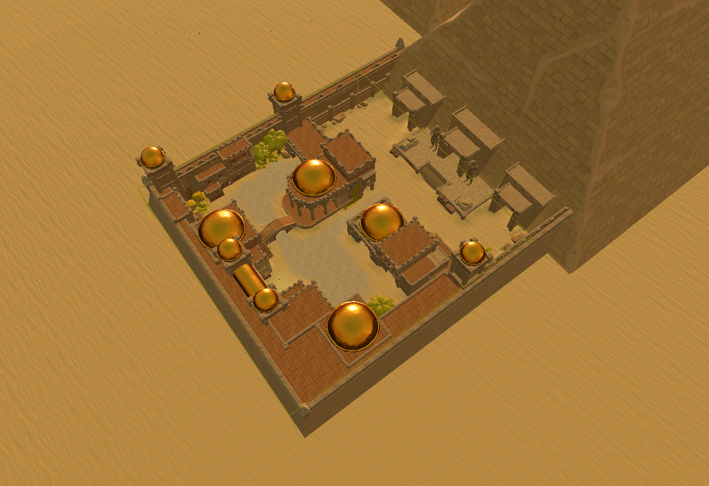

# Submission
To submit, send an email to:

- `tnikolov@hotmail.com`
- `tsakovm@gmail.com`

You should submit one `.zip` file containing:

- the `.txt` story script file
- all `.wav` files
- all `.bvh` files
- all `.fbx` files

The `.fbx` and `.wav` files should be named in ascending order, starting from 1, in the order that they should be played back. Append `A`, `B`, `C`, `D` or `E` to each file to indicate which avatar you wish to use for the animation. The `.fbx` files are extracted using the gesture generation system. The cumulative duration of your `.wav` files should be *4 minutes* long or less.

The avatars and worlds are shown further below.

??? Example

    ```
    - team_name.zip
        - script.txt
            - Team: My Team Name
            - Scene: Forest
            - Script:
            - 1C: Hello there!
            - 2C: My name is Johnny.
            - 3B: Hi Johnny!
            - 4C: And who are you?
            - 5D: I am the Skatteverket :)
        - bvh/
            - 1C.bvh
            - 2C.bvh
            - 3B.bvh
            - 4C.bvh
            - 5D.bvh
        - fbx/
            - 1C.fbx
            - 2C.fbx
            - 3B.fbx
            - 4C.fbx
            - 5D.fbx
        - wav/
            - 1C.wav
            - 2C.wav
            - 3B.wav
            - 4C.wav
            - 5D.wav
    ```

## Avatars


## Worlds

**Egypt**



**Asian village**


**Tropical island**


**Venice**


**Forest**


You can find more examples in the [images](https://github.com/Svito-zar/wasp-2023-summer-school/blob/main/Images/) folder.
