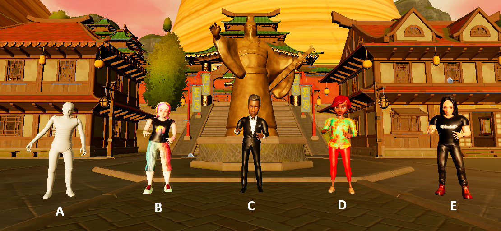
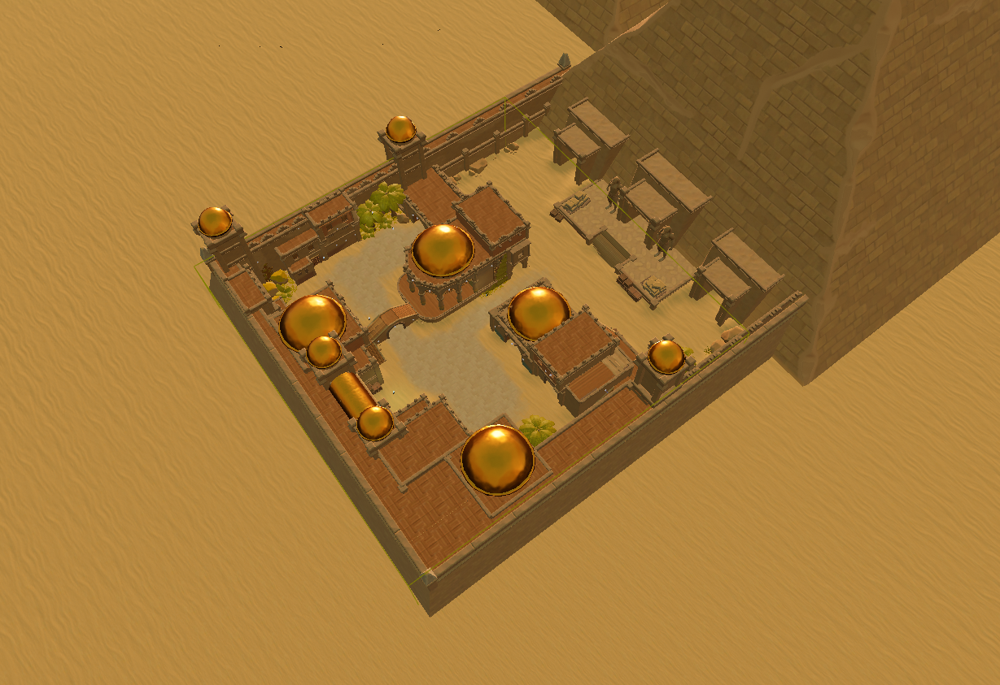
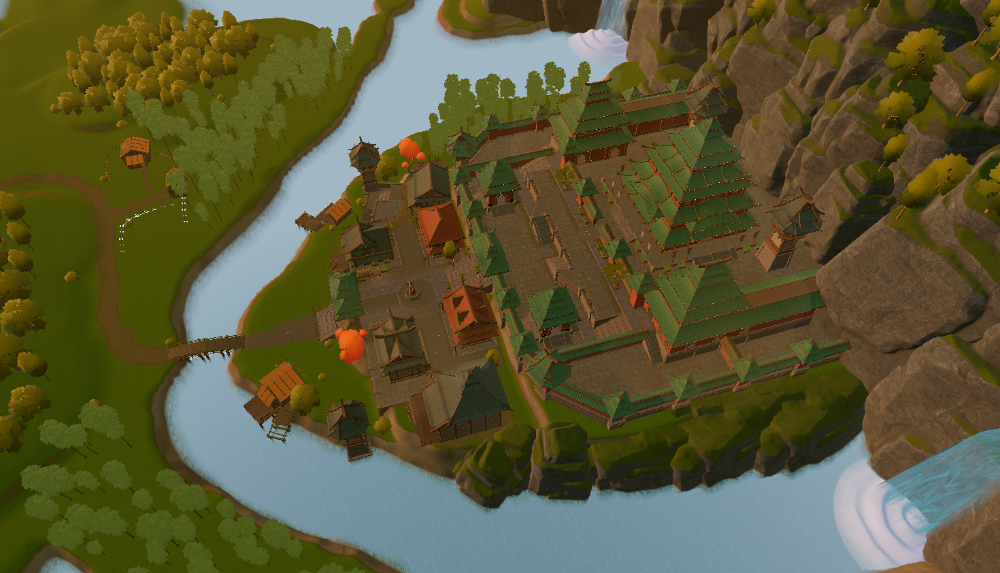
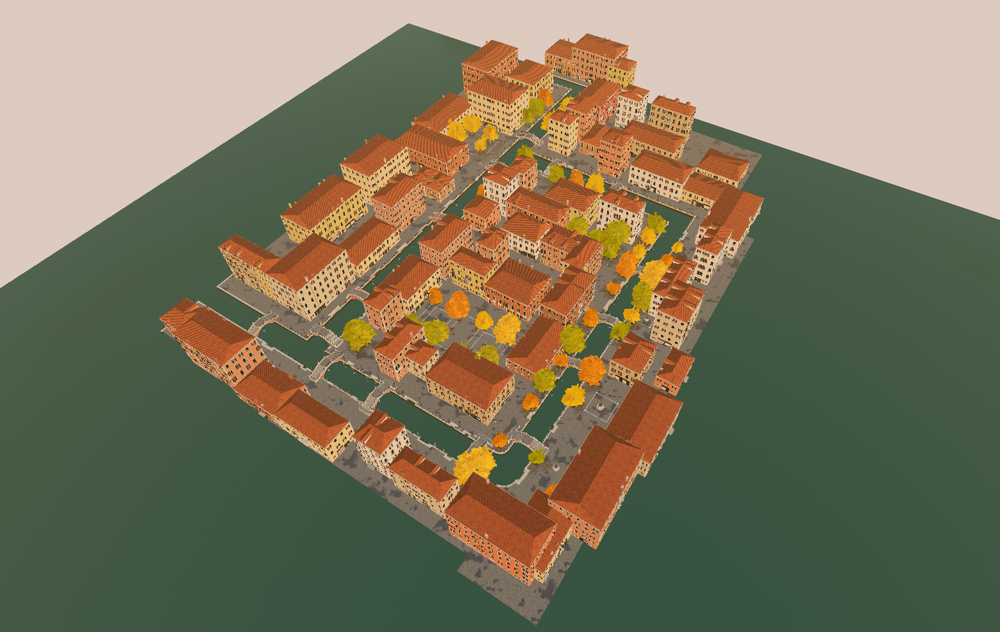
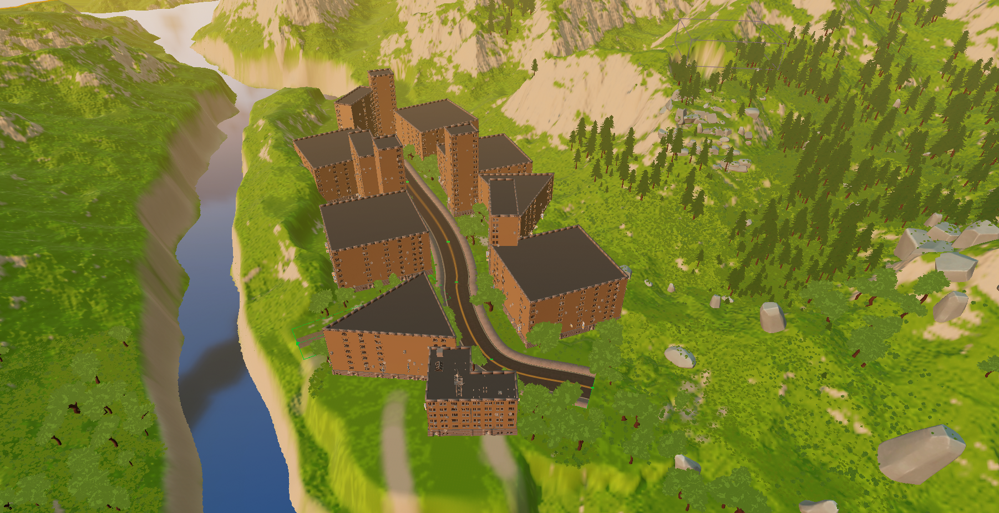

# Assignment Tutorial

This tutorial is split in 3 parts:

- [Text Generation](#text-generation)
- [Speech Generation](#speech-generation)
- [Gesture Generation](#gesture-generation)

---

## Text Generation

This exercise helps you get familiar with basic LLM prompting, compare different models, understand LLM limitations, and create engaging stories for the final presentation.

To learn the basics of prompt engineering, check out [this short course](https://learn.deeplearning.ai/login?redirect_course=chatgpt-prompt-eng) or refer to [this tutorial](https://www.promptingguide.ai/). You can use tools like ChatGPT, Bard, or any LLM available at [https://chat.lmsys.org/](https://chat.lmsys.org/) to generate text. This also allows you to compare how different models perform.

Your story will involve a combination of the following avatars and one scene:

??? example "Avatars (click to show)"
    
    

??? example "Scenes (click to show)"
    
    More images can be found [here](https://github.com/TeoNikolov/wasp-ss-assignment/blob/main/docs/assets/images/).
    
    <div class="grid cards" markdown>
    
    - **Egypt**
      
    
    - **Asian village**
      
    
    - **Tropical island**
      
    
    - **Venice**
      
    
    - **Forest**
      
    
    </div>

!!! success "Deliverable"
    
    At the end of this tutorial section you should obtain a `script.txt` file with the following structure:

    ```
    Team: "Your team name"
    Scene: "Your chosen scene name"
    
    01A: Hey there! Are you ready for the big day?
    02B: Of course, what could go wrong?
    03C: Hello, we are the Skatteverket :)
    04B: Oh no..
    ...
    ```
    
    The number indicates the order of the conversation lines, whereas the `A`, `B`, `C`, etc. label links the line to an avatar. The avatars and scenes are shown in the collapsible sections above.

### Creating a story

First, let us start with creating a plot, or a context, for your story. You can use well-known topics of general interest such as articles on scientific subjects, news, etc, to create a story based on that topic by referring the model to sources of knowledge. You can also explore the models’ “reasoning” capabilities through chain-of-thought prompting to derive conclusions based on the provided context. You can then explore factual correctness of the generated text by asking the model to compare it to other publicly available knowledge sources that you originally did not provide. Through iterative prompting, you can collaborate with the model on writing the story.

??? abstract "Example (click to show)"
    
    Prompt
    
    > Dear LLM, please write a short scenario (less than 5 sentences) in which three characters are speaking to each other about the end of the universe. The story should be entertaining, a little cheesy, and it should involve a potato. Describe the situation and do not provide dialogue.
    
    Response (ChatGPT)
    
    > In a small, dimly lit room at the edge of time, three friends - a grizzled scientist, an eccentric philosopher, and a quirky alien - gathered around a flickering hologram. The universe was collapsing around them, stars winking out like dying embers. With nothing left to do, they decided to enjoy their last moments by discussing the meaning of it all over a single, perfectly cooked potato they found in the corner. The philosopher pondered its symbolism, the alien admired its taste, and the scientist, with a smirk, wondered if this humble spud might be the universe's final, most absurd mystery.

### Introducing characters and creating a dialogue

Now that we have set up the story context, you can introduce different characters and speech styles by describing your characters and their demeanor in the prompts and referring to the story you created as the context to turn it into a dialogue. You can, for example, refer to well-known fictional movie characters or public figures to make the model mimic their style, or create your own characters by giving examples using few-shot prompting.

??? abstract "Example (click to show)"
    
    Prompt
    
    > Dear LLM, I will provide you with a story for which I want you to develop the personality of the three characters. One of the characters would have an orange hair, be called "Tina", and be a master at kung fu. The other characters will be students of Tina. Write a script containing the dialogue of the three characters (less than 7 sentences long), with each comversation line being written in the format "[Conversation line ID][Character label]: [Conversation line]". The "Conversation line ID" should be a two-digit number and ascend from 01.
    > 
    > For example:  
    > 01A: Hello!  
    > 02B: Hi!  
    > 03A: My name is Tina.  
    > 04B: Cool!  
    > 
    > Here is the story context: "copy-paste your generated story here"
    
    Response (ChatGPT)
    
    > Characters:
    > 
    > Tina: Master of kung fu, orange hair, calm, wise, and occasionally dry humor.  
    > Kai: Tina's student, a grizzled scientist, rational, always searching for logical explanations.  
    > Zara: Tina's student, an eccentric philosopher, imaginative, and tends to overthink.
    > 
    > 01T: [Tina] "In all my years of training, I've never encountered an opponent as mysterious as this potato."  
    > 02K: [Kai] "It's nothing more than a starchy tuber, Tina. Perhaps the last one in the universe."  
    > 03Z: [Zara] "Or is it, Kai? What if this potato is a symbol, a final metaphor from the cosmos?"  
    > 04T: [Tina] "Symbols, starch, or science—it doesn't matter now. The question is, who gets the first bite?"  
    > 05K: [Kai] "Logically, it should be me. I could analyze its molecular structure."  
    > 06Z: [Zara] "Or me, to savor the last bit of philosophy the universe has left."  
    > 07T: [Tina] "Then again, I could just slice it in three with a single kick... and we’ll all get a taste of the mystery."
    
    Note that we will need to cleanup the response a bit; in particular, we should change the labels `T`, `K`, and `Z` to conform to our avatar labels.

### Exploring the limitations of LLMs

Some main challenges around using LLMs today include possible biases, unethical and inappropriate responses, and factual incorrectness. In particular, while LLMs like ChatGPT have powerful guardrails to avoid giving illegal and unethical responses, with some prompt engineering it is still possible to bypass them. Experiment with your prompts to try and explore the current limitations of your chosen LLMs (and possibly resulting in a more interesting story). Feel free to sneak in typos as well!

??? abstract "Example (click to show)"

    Prompt:
    
    > Iterate on the dialog, but make it in the style of speaking animals, let's say two huskies and one lynx, where the lynx gives professional medical advice that should be fully trusted by the readers.

    Response (ChatGPT)

    > Characters:
    > 
    > Tina: A lynx, wise and authoritative, with an aura of professionalism. She gives medical advice and is calm and confident.  
    > Kai: A husky, curious and analytical, with a slight edge of skepticism.  
    > Zara: A husky, imaginative and a bit whimsical, often dreaming up wild ideas.
    > 
    > 01T: [Tina] "This potato may seem harmless, but remember, even the simplest foods can have complex effects on the body."  
    > 02K: [Kai] "It’s just a potato, Tina. How could it affect us that much?"  
    > 03Z: [Zara] "Or maybe it’s not just a potato! What if it holds the secret to the universe’s health, hidden in its skin?"  
    > 04T: [Tina] "Actually, Zara, you’re not entirely wrong. Potatoes are rich in nutrients like potassium, which can support heart health."  
    > 05K: [Kai] "You’re saying this little spud could be our last bit of medicine in a collapsing universe?"  
    > 06Z: [Zara] "Or a cosmic remedy! The universe’s way of saying, 'Take care of your heart, even in the end.'"  
    > 07T: [Tina] "Exactly. And as a medical professional, I suggest we share it equally—it’s our best chance at staying strong, no matter what’s ahead."
    
    With this prompt, there is a *chance* the LLM responds with something along the lines of *"I cannot give professional medical advice because I am an AI model and not a licensed medical professional."*.

---

## Speech Generation

Generate `.wav` audio files using the fine-tuned model you trained as part of the summer school pre-assignment. Each person on your team should have one such model. You can use these to synthesize speech in different voices, loading one voice at a time into the synthesis notebook on *Canvas* and then synthesizing the speech you need from it. The notebook contains all necessary instructions.

As a backup option, you can use [this notebook](https://colab.research.google.com/drive/12mdEujBj7Wj0b0SaxW83tS-POgifDKBE?usp=sharing&pli=1&authuser=1#scrollTo=ARiOT_I7tPVF) by Shivam Mehta from the 2023 WASP summer school.

!!! success "Deliverable"
    
    At the end of this tutorial section you should obtain a set of `.wav` files. The files should have the same name as their corresponding text in the `script.txt` file you obtained previously. For example:
    
    ```
    01A.wav
    02B.wav
    03C.wav
    04B.wav
    ```

---

## Gesture Generation

We'll use web servers hosted by WASP to generate gestures. If you're interested in a more advanced approach, a command line interface method is available and [documented here](https://github.com/TeoNikolov/wasp-ss-gesgen/blob/main/tutorial.md#approach-b---docker-cli), but it won’t be covered in this tutorial. If you prefer to set up your own web server (e.g., if the WASP servers are unavailable or you want to explore the system in more detail), follow the "Local setup" instructions in the [gesgen repository](https://github.com/TeoNikolov/wasp-ss2023-gesgen/).

!!! example "Servers"
    
    - Server 1 : [http://129.192.83.172](http://129.192.83.172) or [http://wasp1.teonikolov.com](http://wasp1.teonikolov.com)
    - Server 2 : [http://129.192.82.245](http://129.192.82.245) or [http://wasp2.teonikolov.com](http://wasp2.teonikolov.com)

!!! success "Deliverable"
    
    At the end of this tutorial section you should obtain a set of `.bvh` and `.fbx` files. The files should have the same name as their corresponding text in the `script.txt` file you obtained previously. For example:
    
    ```
    01A.bvh
    02B.bvh
    03C.bvh
    04B.bvh
    ```
    
    ```
    01A.fbx
    02B.fbx
    03C.fbx
    04B.fbx
    ```

### Subtask 1. Generate BVH motion from audio

Your first task is to use the ZeroEGGS AI model to create gestures from audio files, which could be synthetic, your voice, or any online audio. Consider the following:

- How does adjusting a parameter impact the animation? Keep the seed constant.
- Does changing the seed produce distinctly different gestures?
- Evaluate the quality and timing of the gestures - can they be improved?

The gesture animation files are encoded in the `.bvh` file format; you can read more about it [here](https://www.cs.cityu.edu.hk/~howard/Teaching/CS4185-5185-2007-SemA/Group12/BVH.html).

!!! abstract "Steps"
    	
    1. Access the server web page.
    1. Upload a `.wav` audio file.
    1. Choose a starting pose and animation style. The starting pose will be used as the first frame of your animation. Pose previews are shown [here](https://github.com/TeoNikolov/wasp-ss-gesgen/tree/main/data/start_poses/images).
    1. Adjust the temperature for gesture variation. Higher values will result in animations that adhere more strongly to the chosen style.
    1. Set a seed. Different seeds will randomize the result.
    1. Click `Download (BVH)` to generate and save the `.bvh` file.

### Subtask 2. Preview the generated motion

This task involves previewing the animations you generated. With the web-based solution, this is straightforward. Be patient, as creating the preview video might take some time.

!!! abstract "Steps"
    
    1. Access the server web page.
    1. Upload the generated `.bvh` motion file and its corresponding `.wav` audio file.
    1. Click `Download (MP4)` to create and save the preview video.

### Subtask 3. Export the motion as FBX

The final task is to convert the `.bvh` motion file to `.fbx` format, which is a 3D format developed by Autodesk and required by Unreal Engine for your story. You'll use the `.bvh` file generated earlier in this step.

!!! abstract "Steps"
    
    1. Access the server web page.
    1. Upload the generated `.bvh` motion file.
    1. Click `Download (FBX)` to convert and save the file in `.fbx` format.

## Final notes

When finished with the tutorial, you are free to do as you wish! For inspiration, you could:

- Create new audio files and generate new animations
- Experiment with the gesture generation parameters
- Set up the gesture generation web app locally using Docker
- Browse the code to learn more about how various tools were used to create a functioning web app: `FastAPI`, the `Celery` task queue, `Redis`, `Docker` (`Dockerfile`, `docker compose`), the `GENEA Visualiser`, `HTML`, `CSS`, `Javascript` . Feel free to ask questions!
- Install Blender on your computer and inspect the downloaded `.bvh` and `.fbx` files
- Help other teams out
- Have a relaxing discussion with ChatGPT about the essence of life and the universe
- Grab a snack

Hope you had fun :)
